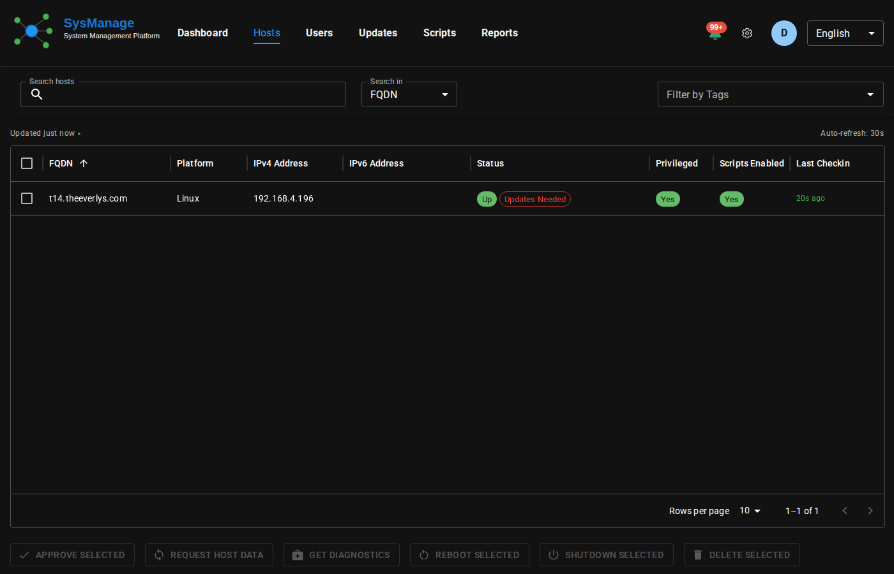

# SysManage Documentation

> **Modern Infrastructure Management Made Simple**

This repository contains the complete documentation for SysManage, an open-source infrastructure management platform that provides centralized monitoring, control, and automation for distributed systems.



[](https://bceverly.github.io/sysmanage-docs/)
[](https://github.com/bceverly/sysmanage-docs/actions)
[](https://github.com/bceverly/sysmanage-docs/actions)
[](LICENSE)

## 📚 Documentation

- **[Getting Started](docs/getting-started/)** - Quick start guide and tutorials
- **[Server Documentation](docs/server/)** - Installation, configuration, and deployment
- **[Agent Documentation](docs/agent/)** - Cross-platform agent setup and management
- **[API Reference](docs/api/)** - Complete REST API documentation
- **[Security](docs/security/)** - Authentication, mTLS, and best practices
- **[Architecture](docs/architecture/)** - System design and scaling strategies
- **[Administration](docs/administration/)** - Backup, maintenance, and troubleshooting

## 🚀 Quick Start

1. **Install SysManage Server**
   ```bash
   # Download and install the server
   curl -sSL https://install.sysmanage.org/server | bash
   ```

2. **Deploy Agents**
   ```bash
   # Install agent on managed hosts
   curl -sSL https://install.sysmanage.org/agent | bash
   ```

3. **Access Dashboard**
   - Open your web browser to `https://your-server:8443`
   - Complete the initial setup wizard
   - Start managing your infrastructure

## 🏗️ Building Documentation

This documentation site is built with:
- **HTML/CSS/JavaScript** - Static site generation
- **Internationalization** - Support for 14 languages
- **GitHub Pages** - Automated deployment
- **Accessibility Testing** - WCAG 2.1 AA compliance

### Local Development

```bash
# Clone the repository
git clone https://github.com/bceverly/sysmanage-docs.git
cd sysmanage-docs

# Install dependencies
npm install

# Start local server
npm run serve

# Generate screenshots (requires dependencies)
npm run screenshots
```

### Building and Testing

```bash
# Run all quality checks
make check

# Run individual checks
npm run lint        # Markdown linting
npm run spellcheck  # Spelling validation
npm run linkcheck   # Link validation
npm run a11y        # Accessibility testing
```

## 🌍 Internationalization

SysManage documentation is available in 14 languages:

- **English** (en) - Primary
- **Spanish** (es)
- **French** (fr)
- **German** (de)
- **Italian** (it)
- **Portuguese** (pt)
- **Dutch** (nl)
- **Russian** (ru)
- **Chinese Simplified** (zh_CN)
- **Chinese Traditional** (zh_TW)
- **Japanese** (ja)
- **Korean** (ko)
- **Hindi** (hi)
- **Arabic** (ar)

Translation files are located in `assets/locales/` and contributions are welcome!

## 📸 Screenshots

Automated screenshots are generated for:
- Dashboard views
- Configuration pages
- Setup wizards
- Mobile responsive layouts

See [SCREENSHOTS.md](SCREENSHOTS.md) for details on the screenshot generation process.

## 🤝 Contributing

We welcome contributions to improve SysManage documentation!

### Ways to Contribute

- **Report Issues** - Found a bug or outdated information?
- **Improve Content** - Fix typos, clarify instructions, add examples
- **Translate** - Help translate documentation to new languages
- **Add Screenshots** - Provide updated or new screenshots

### Development Workflow

1. Fork the repository
2. Create a feature branch (`git checkout -b feature/amazing-improvement`)
3. Make your changes
4. Test locally (`make check`)
5. Commit your changes (`git commit -am 'Add amazing improvement'`)
6. Push to your branch (`git push origin feature/amazing-improvement`)
7. Open a Pull Request

### Style Guide

- Use clear, concise language
- Include code examples where helpful
- Test all instructions on supported platforms
- Follow accessibility guidelines
- Maintain consistent formatting

## 📁 Repository Structure

```
sysmanage-docs/
├── docs/                   # Documentation content
│   ├── getting-started/    # Getting started guides
│   ├── server/            # Server documentation
│   ├── agent/             # Agent documentation
│   ├── api/               # API reference
│   ├── security/          # Security guides
│   ├── architecture/      # System architecture
│   └── administration/    # Admin guides
├── assets/                # Static assets
│   ├── css/              # Stylesheets
│   ├── js/               # JavaScript
│   ├── images/           # Images and icons
│   └── locales/          # Translation files
├── .github/              # GitHub workflows
├── scripts/              # Build and utility scripts
└── node_modules/         # Dependencies
```

## 🔗 Related Projects

- **[SysManage Server](https://github.com/bceverly/sysmanage)** - Core management server
- **[SysManage Agent](https://github.com/bceverly/sysmanage-agent)** - Lightweight monitoring agent
- **[SysManage CLI](https://github.com/bceverly/sysmanage-cli)** - Command-line interface (coming soon)

## 📜 License

This documentation is released under the [MIT License](LICENSE).

## 🆘 Support

- **Documentation Issues** - [GitHub Issues](https://github.com/bceverly/sysmanage-docs/issues)
- **General Support** - [GitHub Discussions](https://github.com/bceverly/sysmanage/discussions)
- **Security Issues** - [Security Reporting](docs/security/reporting.html)

---

**Made with ❤️ by the SysManage team**