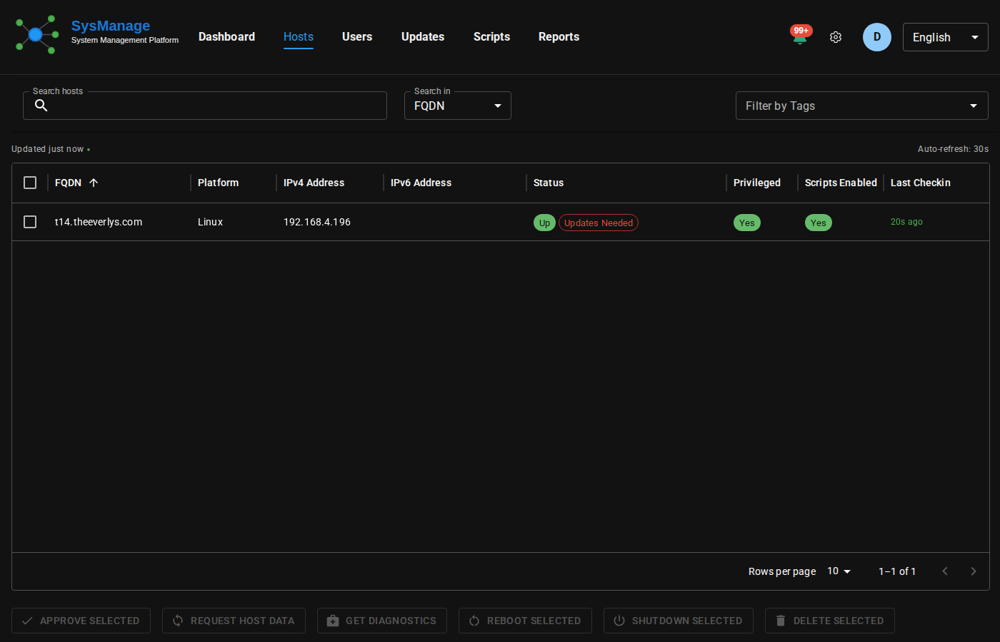

# SysManage Documentation

> **Modern Infrastructure Management Made Simple**

This repository contains the complete documentation for SysManage, an open-source infrastructure management platform that provides centralized monitoring, control, and automation for distributed systems.



[](https://bceverly.github.io/sysmanage-docs/)
[](https://github.com/bceverly/sysmanage-docs/actions)
[](https://github.com/bceverly/sysmanage-docs/actions)
[](LICENSE)

## 📚 Documentation

- **[Getting Started](docs/getting-started/)** - Quick start guide and tutorials
- **[Server Documentation](docs/server/)** - Installation, configuration, and deployment
- **[Agent Documentation](docs/agent/)** - Cross-platform agent setup and management
- **[Deployment](docs/deployment/)** - Deployment guides and topologies
- **[Professional+](docs/professional-plus/)** - Pro+ engines, air-gap deployment, multi-site federation, content lifecycle management, and configuration management, fleet configuration jobs & drift
- **[API Reference](docs/api/)** - Complete REST API documentation
- **[Security](docs/security/)** - Authentication, mTLS, and best practices
- **[Architecture](docs/architecture/)** - System design and scaling strategies
- **[Administration](docs/administration/)** - Backup, maintenance, air-gap runbooks, and troubleshooting

## 🚀 Quick Start

1. **Install SysManage Server**

   ```bash
   # Download and install the server
   curl -sSL https://install.sysmanage.org/server | bash
   ```

2. **Deploy Agents**

   ```bash
   # Install agent on managed hosts
   curl -sSL https://install.sysmanage.org/agent | bash
   ```

3. **Access Dashboard**
   - Open your web browser to `https://your-server:8443`
   - Complete the initial setup wizard
   - Start managing your infrastructure

## 🏗️ Building Documentation

This documentation site is built with:

- **HTML/CSS/JavaScript** - Static site generation
- **Internationalization** - Support for 14 languages
- **GitHub Pages** - Automated deployment
- **Accessibility Testing** - WCAG 2.1 AA compliance

### Local Development

```bash
# Clone the repository
git clone https://github.com/bceverly/sysmanage-docs.git
cd sysmanage-docs

# Install dependencies
npm install

# Start local server
npm run serve

# Generate screenshots (requires dependencies)
npm run screenshots
```

### Building and Testing

```bash
# Run all quality checks
make check

# Run individual checks
npm run lint        # Markdown linting
npm run spellcheck  # Spelling validation
npm run linkcheck   # Link validation
npm run a11y        # Accessibility testing
```

## 🌍 Internationalization

SysManage documentation is available in 14 languages:

- **English** (en) - Primary
- **Spanish** (es)
- **French** (fr)
- **German** (de)
- **Italian** (it)
- **Portuguese** (pt)
- **Dutch** (nl)
- **Russian** (ru)
- **Chinese Simplified** (zh_CN)
- **Chinese Traditional** (zh_TW)
- **Japanese** (ja)
- **Korean** (ko)
- **Hindi** (hi)
- **Arabic** (ar)

Translation files are located in `assets/locales/` and contributions are welcome!

`make lint` runs an **offline** i18n gate (`i18n-validate` + `translate-check`,
no translation service needed): it fails if any `data-i18n` key is missing
from a locale or left untranslated, so gaps are caught locally at `pre-push`
rather than in CI. After editing pages, run `make i18n-autotag` to tag + seed
new strings, fill them on your model rig (`make translate SERVICE=http://<host>:8765`),
then re-run `make lint`. (Mirrors the same gate in `sysmanage`,
`sysmanage-agent`, and `sysmanage-professional-plus`.)

### Writing translatable strings

The translation service enforces **placeholder integrity**: a translation must
carry exactly the same HTML tags and entities as the English source -- none
dropped, none invented -- and it re-prompts the model twice before giving up and
keeping the English. Two authoring rules follow from that, both measured
against the live service on 2026-08-25 rather than guessed:

**1. Put NO inline markup inside a translatable string.** Not one `<code>`, not
one `<strong>`. This is the rule that actually holds. Measured across 13
locales on 2026-08-25: four tags failed almost everywhere; two tags still failed
in a third of locales (13 of 14 remaining failures were two-tag strings); zero
tags passed. Keep the markup -- just put it OUTSIDE the translated span:

```html
<!-- BAD: 2 tags.  Passes in some languages, fails in others. -->
<p data-i18n="x.bypass">SysManage passes <code>--bypass-driver</code> to rpm-ostree
   by default.</p>

<!-- GOOD: the identifier keeps its <code> styling, outside the key -->
<p><span data-i18n="x.bypass">SysManage passes this flag to rpm-ostree by
   default:</span> <code>--bypass-driver</code></p>
```

Decorative `<strong>`/`<em>` inside a sentence is usually not worth a failed
locale -- drop it. For an identifier mid-sentence, either lift it to the end
behind a colon as above, or leave it as plain text.

**2. Use literal typographic characters, not HTML entities.** `&mdash;`,
`&rsquo;`, `&ldquo;` and friends are matched as placeholders that must be
reproduced byte-exactly, so each is another way to fail -- for nothing, since the
locale JSON stores UTF-8 and the rest of the catalog already uses literal `--`
and `’`. Keep `&lt;`, `&gt;` and `&amp;`: those are structural.

**Do not put literal command output or log lines inside a translatable key.**
They should not be translated at all (users grep for the English), and they tend
to carry `<br>` and escaped angle brackets that break integrity. Put them in a
`<pre><code>` block with no `data-i18n` and keep only the lead-in translatable.

**Failures are deterministic per (string, locale) -- re-running does not fix
them.** A string that fails for `ko` fails for `ko` every time; the same string
may pass for `nl`. That looks like randomness if you only compare locales, and
it is tempting to just re-run `make translate` until it clears. It will not:
verified by sending one string three times and getting the identical
`fallback:placeholders` verdict. Re-running only helps for keys you have
actually changed. If a key is in the gap list, rewrite it.

## 📸 Screenshots

Automated screenshots are generated for:

- Dashboard views
- Configuration pages
- Setup wizards
- Mobile responsive layouts

See [SCREENSHOTS.md](SCREENSHOTS.md) for details on the screenshot generation process.

## 🤝 Contributing

We welcome contributions to improve SysManage documentation!

### Ways to Contribute

- **Report Issues** - Found a bug or outdated information?
- **Improve Content** - Fix typos, clarify instructions, add examples
- **Translate** - Help translate documentation to new languages
- **Add Screenshots** - Provide updated or new screenshots

### Development Workflow

1. Fork the repository
2. Create a feature branch (`git checkout -b feature/amazing-improvement`)
3. Make your changes
4. Test locally (`make check`)
5. Commit your changes (`git commit -am 'Add amazing improvement'`)
6. Push to your branch (`git push origin feature/amazing-improvement`)
7. Open a Pull Request

### Style Guide

- Use clear, concise language
- Include code examples where helpful
- Test all instructions on supported platforms
- Follow accessibility guidelines
- Maintain consistent formatting

## 📦 Package Repositories

The package repositories for installing SysManage Agent on various platforms are
hosted on **Cloudflare R2** at `https://repo.sysmanage.org` (the `repo/` tree in
this repo is synced there by `deploy.yml`; it is no longer served from GitHub
Pages, which caps artifacts at 1 GB):

### DEB Repository (Ubuntu/Debian)

```bash
# Install the archive signing key
sudo install -d -m 0755 /usr/share/keyrings
curl -fsSL https://repo.sysmanage.org/agent/sysmanage-archive-keyring.gpg \
  | sudo tee /usr/share/keyrings/sysmanage-archive-keyring.gpg > /dev/null
# Add the repository, verified against that key
echo "deb [signed-by=/usr/share/keyrings/sysmanage-archive-keyring.gpg] https://repo.sysmanage.org/agent/deb stable main" | \
  sudo tee /etc/apt/sources.list.d/sysmanage.list
sudo apt update && sudo apt install sysmanage-agent
```

The repository is GPG-signed; apt verifies every update against that key.
Primary key fingerprint `896E ED43 9F5E 9BB1 FCA6 69A5 E033 E691 377F 0AE3`
(confirm with `gpg --show-keys /usr/share/keyrings/sysmanage-archive-keyring.gpg`).
This README previously documented `[trusted=yes]`, which installs whatever the
CDN serves without verifying it -- do not reintroduce it.

**Supported Platforms (x86_64/amd64 and aarch64/arm64):**

- Ubuntu 26.04 LTS (Resolute) and earlier LTS releases back to 22.04
- Debian 12 (Bookworm) and later

`apt` automatically selects the correct architecture (amd64 or arm64) for your
host. The same repository also serves Launchpad PPA builds for both architectures.

### RPM Repository (RHEL/CentOS/Fedora/Rocky/AlmaLinux/Oracle Linux)

RPM packages are available via [Fedora Copr](https://copr.fedorainfracloud.org/coprs/bceverly/sysmanage/) for both **x86_64** and **aarch64** architectures:

```bash
sudo dnf copr enable bceverly/sysmanage
sudo dnf install sysmanage        # Server
sudo dnf install sysmanage-agent  # Agent
```

**Supported targets (x86_64 and aarch64):**

- **EPEL 10 / CentOS Stream 10** - Python 3.12
- **EPEL 9 / RHEL 9 / Rocky 9 / AlmaLinux 9 / Oracle Linux 9 / CentOS Stream 9** - Python 3.9+
- **EPEL 8 / RHEL 8 / Rocky 8 / AlmaLinux 8 / Oracle Linux 8** - Python 3.11 via AppStream
- **Fedora 41, 42, 43** - Python 3.13+

### openSUSE/SLES (via Open Build Service)

- **openSUSE Leap 15.x** - Python 3.11
- **openSUSE Tumbleweed** - Python 3.11+
- **SUSE Linux Enterprise Server 15** - Python 3.11

### Other Platforms

- **Alpine Linux** 3.19, 3.20, 3.21 - APK packages
- **macOS** 11+ (Big Sur) - Universal `.pkg` installer (Intel and Apple Silicon)
- **Windows** 10+ / Server 2019+ - MSI installer (x64 and ARM64)
- **FreeBSD** 14.0+ - `.pkg` packages (x86_64)
- **OpenBSD** 7.7, 7.8 - Port tarballs and binary packages (x86_64)
- **NetBSD** 10.0+ - `.tgz` packages (x86_64)
- **Snap** - Available via `snap install sysmanage`
- **Flatpak** - Agent available via Flatpak (x86_64)

For more details, see:

- [DEB Repository Documentation](https://repo.sysmanage.org/deb/README.md)
- [RPM Repository Documentation](https://repo.sysmanage.org/rpm/README.md)
- [General Repository Documentation](https://repo.sysmanage.org/README.md)

## 📁 Repository Structure

```text
sysmanage-docs/
├── docs/                   # Documentation content
│   ├── getting-started/    # Getting started guides
│   ├── server/            # Server documentation
│   ├── agent/             # Agent documentation
│   ├── deployment/        # Deployment guides and topologies
│   ├── professional-plus/ # Pro+ / Enterprise feature documentation
│   ├── comparison/        # Comparisons with other management platforms
│   ├── api/               # API reference
│   ├── security/          # Security guides
│   ├── architecture/      # System architecture
│   └── administration/    # Admin guides
├── roadmap/               # Public roadmap page
├── screenshots/           # Capture harness + generated product screenshots
├── repo/                  # Package repositories
│   ├── deb/              # Debian/Ubuntu APT repository
│   ├── rpm/              # Red Hat/Fedora YUM/DNF repository
│   │   ├── el8/          # RHEL 8, Rocky 8, AlmaLinux 8, Oracle Linux 8
│   │   ├── el9/          # RHEL 9, Rocky 9, AlmaLinux 9, Oracle Linux 9
│   │   ├── el10/         # RHEL 10, CentOS Stream 10
│   │   └── fedora/       # Fedora 41+
│   ├── agent/            # Agent-specific packages
│   └── server/           # Server-specific packages
├── assets/                # Static assets
│   ├── css/              # Stylesheets
│   ├── js/               # JavaScript
│   ├── images/           # Images and icons
│   └── locales/          # Translation files
├── .github/              # GitHub workflows
├── scripts/              # Build and utility scripts
└── node_modules/         # Dependencies
```

## 🔗 Related Projects

- **[SysManage Server](https://github.com/bceverly/sysmanage)** - Core management server
- **[SysManage Agent](https://github.com/bceverly/sysmanage-agent)** - Lightweight monitoring agent
- **[SysManage CLI](https://github.com/bceverly/sysmanage-cli)** - Command-line interface (coming soon)

## 📜 License

This documentation is released under the [GNU Affero General Public License Version 3](LICENSE).

## 🆘 Support

- **Documentation Issues** - [GitHub Issues](https://github.com/bceverly/sysmanage-docs/issues)
- **General Support** - [GitHub Issues](https://github.com/bceverly/sysmanage/issues)
- **Security Issues** - [Security Reporting](docs/security/reporting.html)

---

Made with ❤️ by the SysManage team
